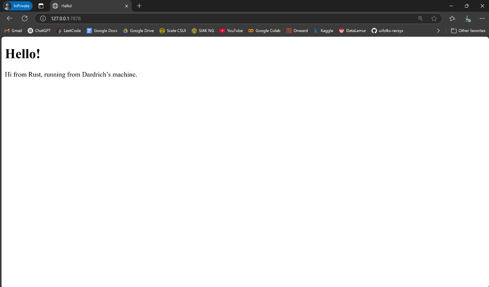

## Commit 1 Reflection Notes

What is inside the `handle_connection` method?

```rust
fn handle_connection(mut stream: TcpStream) {
    let buf_reader = BufReader::new(&mut stream);
    let http_request: Vec<_> = buf_reader
        .lines()
        .map(|result| result.unwrap())
        .take_while(|line| !line.is_empty())
        .collect();

    println!("Request: {:#?}", http_request);
}
```

1) Membaca data dari koneksi TCP
Method menggunakan `BufReader` untuk membaca data dari `TcpStream` secara efisien secara baris perbaris
2) Mengumpulkan header HTTP
Method membaca setiap baris request HTTP hingga menemukan baris kosong (sebagai penanda akhir dari header). Baris-baris ini disimpan dalam sebuah vektor (`Vec<String>`)
3) Mencetak request ke console
Method mencetak seluruh header HTTP yang telah dikumpulkan ke console dalam format yang mudah dibaca (`{:#?}` untuk pretty-print)

## Commit 2 Reflection Notes


What is inside the new `handle_connection` method?
1) Membaca File HTML
Kode sekarang membaca isi file `hello.html` menggunakan `fs::read_to_string("hello.html").unwrap()`. File ini akan dikirim sebagai bagian dari respons HTTP.
2) Membuat Respons HTTP
Kode membuat respons HTTP lengkap dengan status line (HTTP/1.1 200 OK), header Content-Length, dan konten dari file `hello.html`. Format respons sesuai dengan protokol HTTP.
3) Mengirim Respons ke Client
Kode mengirim respons yang telah dibuat ke client menggunakan `stream.write_all(response.as_bytes()).unwrap()`. Ini mengirimkan data melalui koneksi TCP yang sama.

